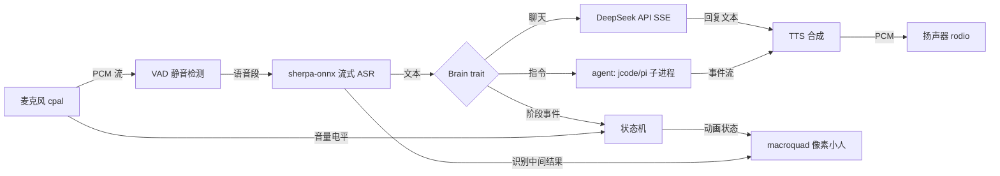

# voxelf — 语音交互像素小人(Rust)

麦克风 → ASR → 大模型(DeepSeek)→ TTS → 扬声器,全程由一个像素小人动画化呈现;二期接入 agent(pi / jcode),用语音驱动 agent 干活。

## 1. 总体架构



核心思想:所有模块(音频、ASR、大脑、TTS)都只向**状态总线**发事件,渲染层只消费状态。这样"大脑"从 DeepSeek 换成 agent 时,UI 和音频层零改动。

## 2. 技术选型(已验证 crates.io 活跃度)

| 环节 | 选型 | 备选 | 说明 |
|---|---|---|---|
| 麦克风采集 | `cpal` | — | 事实标准,Windows 走 WASAPI,回调式流 |
| 音频播放 | `rodio`(基于 cpal) | 裸 cpal | 有 Sink 队列,直接喂 TTS 的 PCM |
| 语音识别 | `sherpa-onnx` 1.13.4 | `whisper-rs` 0.16 | 流式(边说边出字)+ 内置 silero-vad,中文用 Zipformer/Parakeet 模型,CPU 实时率 <0.5。whisper 非流式、延迟高,只适合离线批量 |
| 大模型 | DeepSeek API(OpenAI 兼容),`reqwest` 手写 SSE | `async-openai`(改 base_url) | DeepSeek 无 ASR/TTS 服务,只负责对话 |
| 语音合成 | **vits-zh-ll(定稿)**: 16kHz,14字 0.65s,首句 0.15s | kokoro(中英双语,~2.2s,音质好); supertonic-3(极快但无中文); matcha zh-en(双语+快,待接入) | 中文为主场景的最优平衡;`tts_kind` 可随时切换 |
| 渲染 | `macroquad` | `bevy`(重)、`pixels`(裸 framebuffer,太底层) | 轻量跨平台,2D 像素风友好,API 简单,项目规模匹配 |
| 异步 | `tokio` + `flume`/`tokio::mpsc` | — | 每阶段一个 task;sherpa-onnx 是同步 C 调用,放 `spawn_blocking` |
| 配置 | `config` / `serde` + TOML | — | 存 API key、模型路径、语音参数 |

成本:本地 ASR/TTS 全免费,DeepSeek 按 token 计费(很低)。若想全离线,二期可把 Brain 换成 llama.cpp/Qwen 本地模型。

## 3. 像素小人

- **方案**:macroquad 主循环 + sprite sheet PNG(Aseprite 制作,程序加载,逐帧播放),起步阶段先用**代码生成像素矩阵**(16x16 或 32x32,定义在 Rust 里,程序上色)占位,不阻塞开发。
- **状态 → 动画映射**:

| 状态 | 动画 |
|---|---|
| Idle | 待机呼吸(上下浮动 + 眨眼) |
| Listening | 耳朵竖起 / 头顶音量条随麦克风电平波动 |
| Thinking | 原地打转 + 头顶灯泡 |
| Speaking | 嘴巴张合(可粗略对齐 TTS 播放时长) |
| Working(agent 模式) | 敲键盘动作 + 屏幕闪烁 |
| Error | 变灰 / 头顶问号 |

## 4. 并发与状态机

```rust
enum Phase { Idle, Listening, Thinking, Speaking, Working, Error }

struct AppState {
    phase: Phase,
    asr_partial: String,      // 识别中间结果,实时上屏
    reply_text: String,       // 当前播报文本
    mic_level: f32,           // 麦克风电平,驱动音量条
}
```

数据流:cpal 音频回调线程 → `flume` 无锁 channel → ASR task(`spawn_blocking`)→ 识别结果发状态总线 → 触发 Brain → TTS 异步合成 → rodio 播放,播放结束回到 Idle。

## 5. 项目结构

```
voxelf/
├── Cargo.toml
├── config.toml            # api_key、模型路径、语速、音量
├── assets/
│   ├── models/            # sherpa-onnx 模型(encoder/decoder/joiner + tokens + TTS 模型)
│   └── sprites/           # 像素小人 sprite sheet
└── src/
    ├── main.rs            # 装配 + tokio 启动
    ├── audio/
    │   ├── input.rs       # cpal 采集 + 电平计算
    │   └── output.rs      # rodio 播放
    ├── asr.rs             # sherpa-onnx 流式识别 + VAD
    ├── tts.rs             # sherpa-onnx Kokoro 合成
    ├── brain/
    │   ├── mod.rs         # Brain trait(事件流)
    │   ├── deepseek.rs    # SSE 流式聊天
    │   └── agent.rs       # 二期:jcode/pi 子进程适配
    ├── state.rs           # 状态机 + 事件总线
    └── ui/
        ├── app.rs         # macroquad 主循环
        └── sprite.rs      # 像素动画播放器
```

## 6. Agent 接入设计(二期)

```rust
#[async_trait]
trait Brain {
    async fn chat(&mut self, text: &str) -> Vec<BrainEvent>;
}

enum BrainEvent { Delta(String), Thinking(String), Action(String), Done(String) }
```

- jcode 已确认有 headless 模式:`jcode run "say hello"`。
- `agent.rs` 用 `tokio::process::Command` 起子进程,stdin 喂指令,stdout 流式解析 `thinking / action / result` 事件 → 分别映射到小人动画和 TTS。
- Brain trait 同时被 DeepSeek 和 agent 实现,UI/音频层不感知差异。二期甚至可做**双模式**:先问 agent"这是个操作类请求",是则进 Working 态。

## 7. 里程碑(按序交付)

| 里程碑 | 内容 | 预计 |
|---|---|---|
| M0 | cargo 工程 + macroquad 窗口 + 像素小人待机动画 | 0.5–1 天 |
| M1 | cpal 采集 → sherpa-onnx 流式 ASR → 终端打印识别文本 | 1–2 天 |
| M2 | + DeepSeek API + TTS + 播放,终端闭环跑通 | 1 天 |
| M3 | 状态机 + 各阶段动画 + 波形可视化 | 1–2 天 |
| M4 | Brain trait 拆分 + jcode/pi 子进程适配(Working 动画) | 2–3 天 |
| M5 | 语音打断(barge-in)、上下文记忆、情绪系统、打包分发 | 2–3 天 |

## 8. 风险与对策

- **首次编译慢**:sherpa-onnx 静态链接 onnxruntime,首次 build 10–20 分钟,属正常;模型需下载(~100–400MB)。
- **Windows 音频**:回声/啸叫,开发期用耳机测试;回声消除留后续(VoIP 级方案复杂,不必 MVP 做)。
- **打断功能**:实现中等复杂(播放时继续跑 VAD,检测到语音就停 TTS),放 M5。
- **网络依赖**:DeepSeek API 需 key 与网络;本地 ASR/TTS 不受影响,断网时小人可播兜底话术。
- **模型文件体积**:Kokoro 中文音色 ~100–300MB;可后续换更小的模型或改云端 CosyVoice。

## 9. 环境前置

- Windows + Rust MSVC toolchain(Visual Studio Build Tools 需含 C++ 组件,cpal/onnxruntime 需要)。
- DeepSeek API key(填入 config.toml)。
- M0 起手只需 cargo,无其他依赖。
