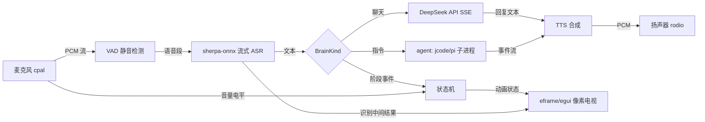

# voxelf 🎧 语音交互像素桌宠

> 对着麦克风说话,像素小人会识别、思考、用语音回复你;还能接入 jcode agent,帮你联网查天气、读写文件、执行任务。

**麦克风 → 流式 ASR → 大模型(DeepSeek / agent)→ 流式 TTS → 扬声器**,全程由一个像素小人动画化呈现。

[](https://www.rust-lang.org)
[](https://gitee.com/fuchenDSG/voxelf/releases)
[](LICENSE)

---

## ✨ 特性

- 🗣️ **全本地流式语音识别**:sherpa-onnx Zipformer2 中文模型(边说边出字),CPU 实时率 <0.5,内置 Silero VAD 静音检测
- 🧠 **DeepSeek 流式对话**:SSE 逐字输出,回复随出随播
- 🔊 **分句流式 TTS**:vits-zh 首句 0.15s 极速响应,可一键切换 kokoro 音色
- 🖥️ **像素电视桌宠**:32x32 像素网格 + CRT 效果,颜文字状态动画(听/想/说/干活/出错),透明置顶窗口 + 系统托盘
- 🤖 **agent 双层大脑**:检测到 jcode 自动走常驻 repl(工具调用 / 联网搜索 / 上下文记忆),没装就自动降级 DeepSeek
- 📦 **便携分发包**:免安装开箱即用,自带模型与 jcode.exe

## 🚀 快速开始(Windows 用户)

1. 下载最新 `voxelf-win64.zip`([GitHub Releases](https://github.com/3274375092/voxelf/releases) / [Gitee 发行版](https://gitee.com/fuchenDSG/voxelf/releases)),解压到任意目录
2. 双击 `voxelf.exe` 运行,桌面上出现像素小人,直接对它说话即可聊天
3. 首次使用前配置 API Key(二选一):
   - 复制 `config.example.toml` 为 `config.toml`,填入 `[deepseek]` 下的 `api_key`
   - 或设置系统环境变量 `DEEPSEEK_API_KEY`

> 没有 API Key 时,语音识别与合成仍然可用,只有对话回复会报错。

## 🛠️ 从源码构建

```bash
# 环境: Windows + Rust MSVC toolchain(需 Visual Studio Build Tools,含 C++ 组件)

# 1. 下载模型与字体(约几百 MB)
node scripts/download-models.js

# 2. 编译(首次需 10-20 分钟,sherpa-onnx 静态链接 onnxruntime)
cargo build --release

# 3. 运行
./target/release/voxelf.exe
```

## ⚙️ 配置说明

配置文件为 TOML 格式,详见 [`config.example.toml`](config.example.toml)(含全部字段注释)。

| 配置项 | 说明 | 默认 |
|---|---|---|
| `deepseek.api_key` | DeepSeek API Key,留空读环境变量 `DEEPSEEK_API_KEY` | 空 |
| `deepseek.model` | 对话模型 | `deepseek-chat` |
| `brain.kind` | `deepseek`(代码默认)/ `agent`(全走常驻 repl,无降级)/ `hybrid`(推荐: 有 jcode 全走 agent,没有自动降级 DeepSeek) | `deepseek` |
| `models.asr_dir` | ASR 模型目录(纯中文 `asr-zh`,中英双语 `asr-zh-en-2025`) | `assets/models/asr-zh` |
| `models.tts_kind` | `vits`(快)/ `kokoro`(音质好) | `vits` |
| `models.vad_*` | VAD 静音/语音判定阈值,越低越不容易吞句尾 | 见模板 |

## 🖥️ 命令行

```bash
voxelf                    # 图形界面主程序(默认,桌宠模式)
voxelf chat "你好"         # 纯文本对话(不走语音)
voxelf tts "你好" out.wav  # 文字转语音,保存为 wav
voxelf asr-file x.wav      # 对 wav 文件跑语音识别
voxelf speak "你好"        # 流式朗读测试
voxelf tts-bench           # TTS 速度基准
voxelf asr-diag "测试文本"  # ASR 定位测试(排查吞句尾)
voxelf latency             # 各阶段延迟定位
```

## 🤖 agent 功能(让小人帮你干活)

包里已附带便携版 `jcode.exe`。开启后小人不再只是聊天,还能**联网搜索、查天气、读写文件、执行任务**(调用工具时显示"干活"动画,结果用语音播报)。

1. 首次使用先配置 jcode:命令行运行 `jcode.exe`,按提示登录或配置 provider 的 API Key(可与 DeepSeek key 共用)
2. 复制 `config.example.toml` 为 `config.toml`,把 `[brain]` 下 `kind` 改为 `hybrid`(或 `agent`)
   - `hybrid`: 优先用 agent,不可用时自动降级 DeepSeek(推荐)
   - `agent`: 强制只用 agent,不降级
3. 重启 voxelf.exe,说"帮我查一下今天的天气"试试

安全默认:`[brain.agent]` 使用 `minimal` 只读工具集;需要联网/写文件时用 `tools` 白名单,如 `read,write,edit,websearch,webfetch`。单轮超时(默认 120s)自动杀进程重启。

## 🏗️ 架构

所有模块(音频、ASR、大脑、TTS)只向**状态总线**发事件,渲染层只消费状态;换大脑时 UI 和音频层零改动。



**技术选型**:`cpal` 采集 / `rodio` 播放 / `sherpa-onnx` 流式 ASR+VAD / DeepSeek(OpenAI 兼容 SSE)/ `eframe·egui` 渲染 / `tokio` + `flume` 异步 / `tray-icon` 托盘。

## 📁 项目结构

```
voxelf/
├── Cargo.toml
├── config.example.toml    # 配置模板(全部字段)
├── scripts/
│   └── download-models.js # 一键下载模型与字体
├── assets/
│   ├── models/            # sherpa-onnx 模型(ASR/VAD/TTS)
│   └── fonts/             # 中文字体(kaomoji 渲染)
└── src/
    ├── main.rs            # CLI + 装配(日志/线程/窗口)
    ├── pipeline.rs        # 语音主管线: 状态机 + 大脑循环 + 分句流式 TTS
    ├── state.rs           # Phase 状态机 + 共享 UiState
    ├── config.rs          # TOML 配置 + 环境变量兜底
    ├── audio/             # cpal 采集 + 电平 / rodio 播放
    ├── asr.rs             # sherpa-onnx 流式识别 + VAD
    ├── diag.rs            # ASR 定位/延迟诊断 CLI 工具
    ├── tts.rs             # vits/kokoro 合成
    ├── brain/             # BrainEvent 事件流 + BrainKind 分发
    │   ├── deepseek.rs    # SSE 流式聊天
    │   ├── agent.rs       # 常驻 jcode repl 进程适配
    │   └── hybrid.rs      # 双层大脑: agent-first,无 jcode 自动降级
    ├── tray.rs            # 系统托盘
    └── ui/                # 桌宠窗口(像素电视/字幕)+ 颜文字动画
```

## 🗺️ 路线图

| 里程碑 | 内容 | 状态 |
|---|---|---|
| M0 | 工程 + 像素电视待机动画 | ✅ |
| M1 | 麦克风 → 流式 ASR → 终端打印 | ✅ |
| M2 | + DeepSeek + TTS + 播放,终端闭环 | ✅ |
| M3 | 状态机 + 颜文字动画 + 波形可视化 | ✅ |
| M4 | Brain 拆分 + jcode repl 常驻(Working 动画,双层大脑) | ✅ |
| M5 | 语音打断(barge-in)、上下文记忆、情绪系统 | 🚧 计划中 |
| M6 | agent 输出清洗、打断、记忆增强 | 🚧 计划中 |

## ❓ 常见问题

- **提示"模型未下载"**:确认 `assets` 目录与 `voxelf.exe` 在同一目录下,且从解压目录内运行
- **回音/啸叫**:建议戴耳机使用,回声消除后续版本支持
- **小人卡在"思考"**:DeepSeek 连接 10s 超时、流式 60s 超时,agent 120s 超时自动重启,不会永久卡死
- **运行信息与错误**:查看同目录下 `voxelf.log`

## 📄 License

[MIT](LICENSE)
